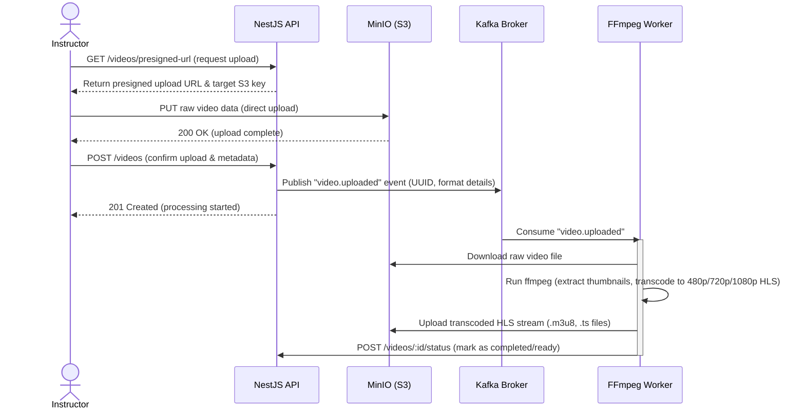
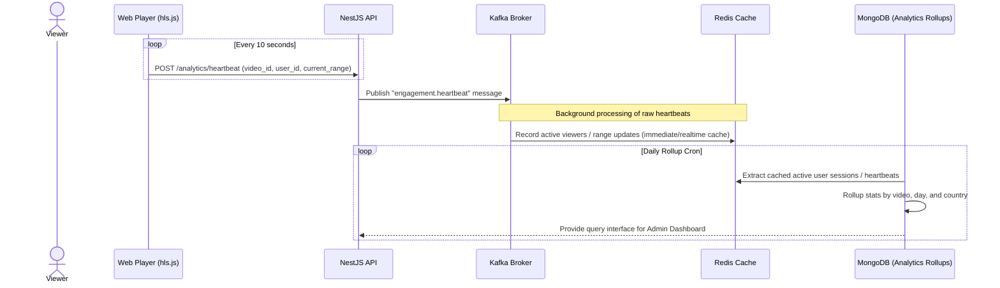

# Aurora: Self-Hosted Video Streaming Platform

A "mini YouTube / Udemy" style platform: users upload video, it gets transcoded into adaptive HLS, streamed to viewers, tracked for engagement analytics, and managed through an admin dashboard. Built with NestJS, Kafka, Redis, PostgreSQL, MongoDB, MinIO, and ffmpeg.

Named after the **aurora borealis**: the UI is a glowing night sky, with a spectral indigo → cyan → violet palette sweeping across deep-space surfaces.

**Domain:** `https://streaming.soylab.dpdns.org`

## Core Flows

### 1. Video Upload & Transcoding Flow


### 2. Stream & Analytics Flow


## Features

- **Auth:** JWT access tokens with refresh-token rotation and reuse detection; RBAC via Casbin (`admin`, `staff`, `user`)
- **Uploads:** presigned MinIO URLs so large files go straight to object storage, never through the app server
- **Transcoding:** Kafka-decoupled ffmpeg worker producing adaptive HLS (1080p / 720p / 480p) with thumbnails extracted first
- **Streaming:** hls.js playback with `Range` support proxied from MinIO
- **Watch history:** per-user resume playback, progress tracking
- **Watch later:** save videos, auto-remove once fully watched
- **Analytics:** view counts, engagement heartbeats → daily rollups in MongoDB
- **Admin dashboard:** upload moderation (approve / ban), user management
- **Search:** title / description lookup on the browse page

## Tech Stack

| Layer | Technology |
|---|---|
| API | NestJS (TypeScript) |
| Relational | PostgreSQL via MikroORM v7 |
| Documents | MongoDB (analytics rollups) |
| Cache / state | Redis |
| Messaging | Kafka |
| Object storage | MinIO (S3-compatible) |
| Transcoding | ffmpeg (worker service) |
| Frontend | React 19, Vite, TanStack, Tailwind CSS 4, hls.js |
| Proxy / TLS | Traefik |

## Repository Layout

```
file-streaming/
├── backend/               ← NestJS API (auth, videos, streaming, analytics, admin)
├── frontend/              ← React + Vite app
├── transcoding-worker/    ← Kafka consumer + ffmpeg HLS transcoder
├── deployments/
│   └── local-dev/         ← Docker Compose for local development
└── Makefile               ← convenience commands
```

## Local Development

```bash
make setup      # copy .env + build images
make domains    # add *.soylab.local to /etc/hosts
make up         # start the full stack
make migrate    # run pending DB migrations
make seed       # seed demo data
make down       # stop everything
```

The stack runs on Docker Compose with Traefik routing: `streaming.soylab.local` (app), `streamingapi.soylab.local` (API), plus MinIO / Kafka UI / Redis Commander / mongo-express consoles.

## Status

Stage 1 (Docker Compose) running; production deploy + Kubernetes/observability stage planned (Phase 9-10).
